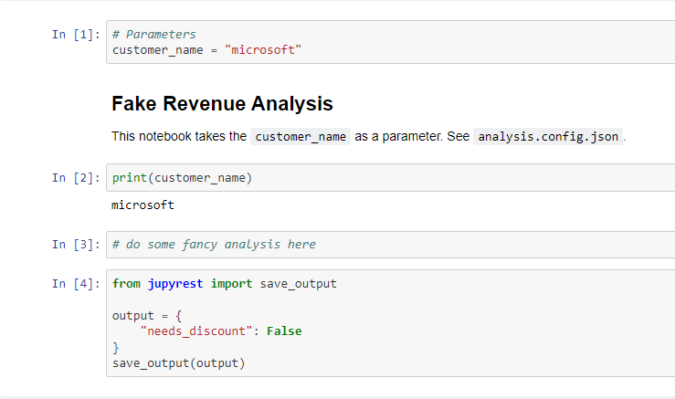

# jupyrest

Jupyrest is a tool that can turn a notebook into a REST API with predefined input and output contracts. This is built upon the [papermill](https://github.com/nteract/papermill) and [scrpabook](https://github.com/nteract/scrapbook) libraries.

## Usage

Suppose you have a notebook `analysis.ipynb` where you have done revenue analysis for a customer. At the end of the notebook, you determine whether the customer is eligible for a enterprise discount or not. You can quickly make your work available as a web api by including a `analysis.config.json` file alongside the notebook:

```json
// analysis.config.json
{
    "input": {
        "type": "object",
        "properties": {
            "customer_name": {
                "type": "string"
            }
        },
        "required": [
            "customer_name"
        ]
    },
    "output": {
        "type": "object",
        "properties": {
            "needs_discount": {
                "type": "boolean"
            }
        },
        "required": [
            "needs_discount"
        ]
    }
}
```

This file tells jupyrest what the schema of the input and output of the REST API should be. Your notebooks folder will now look like this:

```
notebooks/
├── analysis.config.json
└── analysis.ipynb
```

To start the web server, run:

```
python -m jupyrest worker start http --notebooks-dir=./notebooks
```

To execute this notebook:

```
POST /api/NotebookExecutions
Host: localhost:5050
Content-Type: application/json

{
    "notebook": "analysis",
    "parameters": {
        "customer_name": "microsoft"
    }
}
```

And you'll get a response:

```json
{
    "id": "fae94291-8074-475e-8d78-f9667dd33d46",
    "status": "COMPLETED",
    "notebook": "analysis",
    "parameters": {
        "customer_name": "microsoft"
    }
}
```

The `id` represnets the execution id of this notebook. Using this id you can retrieve the execution details at:

```
http://localhost:5050/api/NotebookExecutions?executionId=fae94291-8074-475e-8d78-f9667dd33d46
```

You can view the executed notebook with the `&view_html=true` parameter:



And you can view the output with `&output=true`

```json
{
    "id": "fae94291-8074-475e-8d78-f9667dd33d46",
    "status": "COMPLETED",
    "notebook": "analysis",
    "parameters": {
        "customer_name": "microsoft"
    },
    // if an exception was raised in the notebook,
    // we would see it here
    "exception": null,
    // this is the output we saved in the notebook
    "output": {
        "needs_discount": false
    }
}
```

See the full API at `http://localhost:5050/docs`


## Saving output in a notebook

To save output in a notebook:
```python
from jupyrest import save_output
data = "{'msg': 'some json string'}"
# data can also be any json serializable object
data = dict(a=4, b=5)
save_output(data)
```

## Sharing input/output across notebooks

To facilitate sharing common input and ouput schemas across notebooks, we can use Python objects to represent these schemas. We use the Python library [Pydantic](https://pydantic-docs.helpmanual.io/usage/models/) to let us build Python objects that can be converted into JSON schemas. Users of Jupyrest can utilize all the features of Pydantic by subclassing `NbSchemaBase` which itself is a child of the Pydantic `BaseModel`.

Suppose we have a model class `SampleModel` that we want to share across notebooks. In the input/output JSON schema spec, we can reference this model object with a `$ref` like `nbschema://{model_alias}`. To set an alias for a model, we need to add it to a `ModelCollection`. 


```python
# models.py
from jupyrest.nbschema import ModelCollection, NbSchemaBase
from datetime import datetime

class SampleModel(NbSchemaBase):
    foo: str
    start_time: datetime
    end_time: datetime

# this is added to the plugin
# see jupyrest.plugin:JupyrestPlugin
model_collection = ModelCollection()
model_collection.add_model(alias="sample_model", model_type=SampleModel)
```

In this example we alias `SampleModel` to `"sample_model"` and the io contracts can look like so:

```json
{
    "input": {
        "type": "object",
        "properties": {
            "objects": {
                "type": "array",
                "items": {
                    "$ref": "nbschema://sample_model"
                }
            },
            "foo": {
                "type": "string"
            }
        },
        "required": [
            "objects",
            "foo"
        ]
    },
    "output": {
        "type": "object",
        "properties": {
            "new_objects": {
                "type": "object",
                "properties": {
                    "new_object_1": {
                        "$ref": "nbschema://sample_model"
                    },
                    "new_object_2": {
                        "$ref": "nbschema://sample_model"
                    }
                },
                "required": [
                    "new_object_1",
                    "new_object_2"
                ]
            },
            "bar": {
                "type": "string"
            }
        },
        "required": [
            "new_objects",
            "bar"
        ]
    }
}
```

This notebook can be invoked just as any other notebook with a REST API and a JSON payload. However, when the parameters are added to the notebook they will show up as Python code:

```json
// Sample POST request body
{
    "notebook": "my_notebook",
    "parameters": {
        "objects": [
            {
                "foo": "foo",
                "start_time": "2021-02-28T04:09:09.5730000Z",
                "end_time": "2021-02-28T04:19:09.5730000Z"
            },
            {
                "foo": "foo",
                "start_time": "2021-02-28T04:09:09.5730000Z",
                "end_time": "2021-02-28T04:19:09.5730000Z"
            }
        ],
        "foo": "FOO"
    }
}
```

```python
# Resulting parameters cell
objects = [
    SampleModel(
        foo='foo',
        start_time=datetime.datetime(
            2021, 2, 28, 4, 9, 9, 573000, tzinfo=datetime.timezone.utc
        ),
        end_time=datetime.datetime(
            2021, 2, 28, 4, 19, 9, 573000, tzinfo=datetime.timezone.utc
        ),
    ),
    SampleModel(
        foo='foo',
        start_time=datetime.datetime(
            2021, 2, 28, 4, 9, 9, 573000, tzinfo=datetime.timezone.utc
        ),
        end_time=datetime.datetime(
            2021, 2, 28, 4, 19, 9, 573000, tzinfo=datetime.timezone.utc
        ),
    ),
]
foo = "FOO"
```

Unlike the basic JSON schemas, this will **not** work if this is the first cell of the notebook since it is missing `import` statements. Papermill will look for a notebook code cell tagged with `"parameters"` and it will add the injected parameter cell after it. So to make a notebook work, the imports must be in a cell tagged `"parameters"` or in a cell above it. As of 03/2021, there's no way to edit cell tags in VSCode.

- Follow [this guide](#editing-with-classic-jupyter-notebook-interface) for how to start the classic Jupyter notebook editor.
- Follow [this guide](https://papermill.readthedocs.io/en/latest/usage-parameterize.html) for how to set a parameter cell.

Saving output is done as usual too, there is no need to convert to JSON as that is done automatically. See `models_io.ipynb` in the `tests/` folder for the example.

If we were to get the output for the notebook we executed above it would look like this:

```json
{
    "notebook": "my_notebook",
    "output": {
        "bar": "FOO",
        "new_objects": {
            "new_object_1": {
                "end_time": "2021-02-28T04:19:09.573000+00:00",
                "foo": "foo",
                "start_time": "2021-02-28T04:09:09.573000+00:00"
            },
            "new_object_2": {
                "end_time": "2021-02-28T04:19:09.573000+00:00",
                "foo": "foo",
                "start_time": "2021-02-28T04:09:09.573000+00:00"
            }
        }
    },
    ...
}
```


## Running jupyrest in production

By nature, Jupyter notebooks can be resource intensive and so it makes sense that we want to decouple the web server environment from the notebook execution environment. Jupyrest has a GRPC mode for this purpose. See `./src/jupyrest/protobufs/jupyrest.proto`.

To start the GRPC server run:

```
python -m jupyrest worker start grpc --notebooks-dir={path/to/notebooks}
```

This grpc server is stateless, it does not store any executions or execution ids.